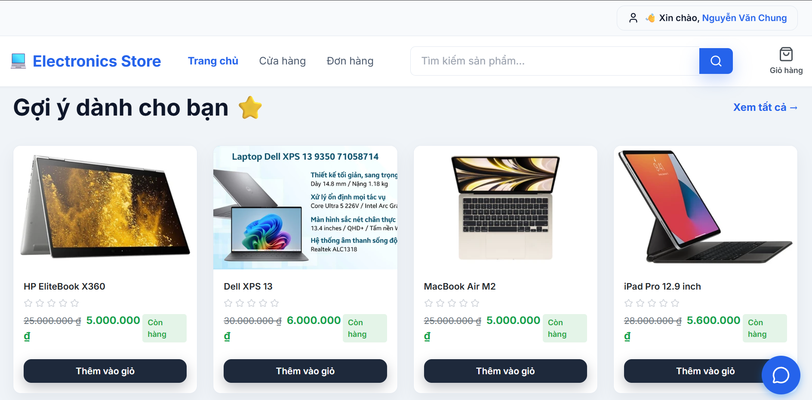
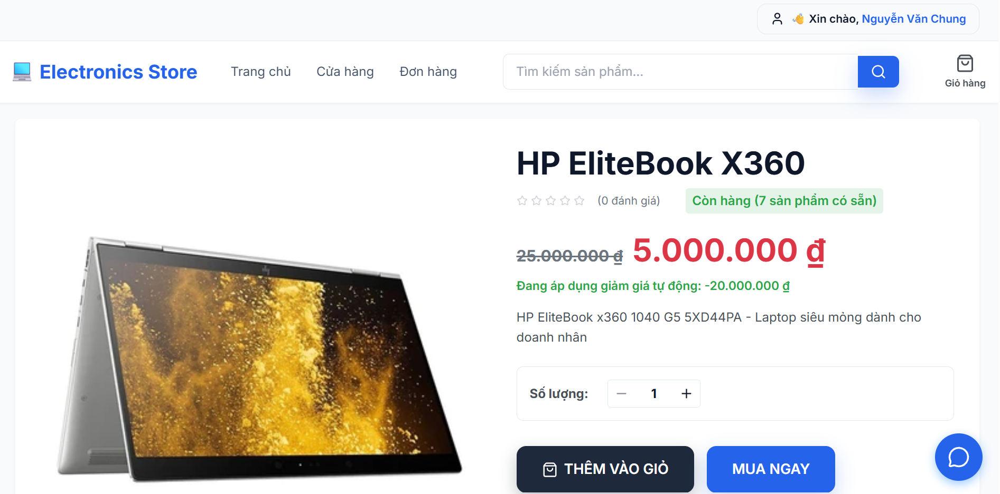
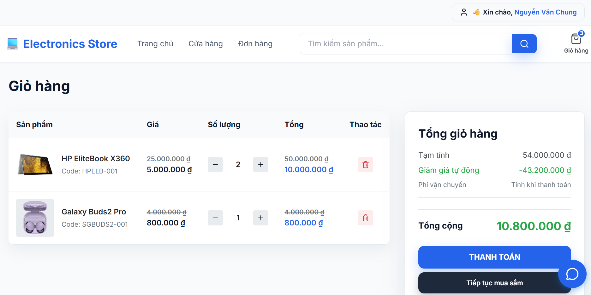
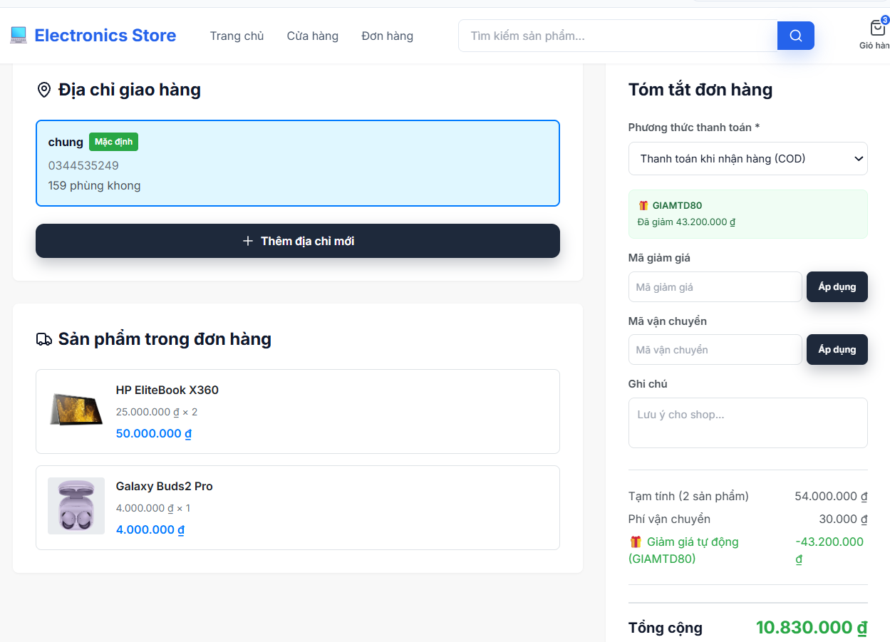
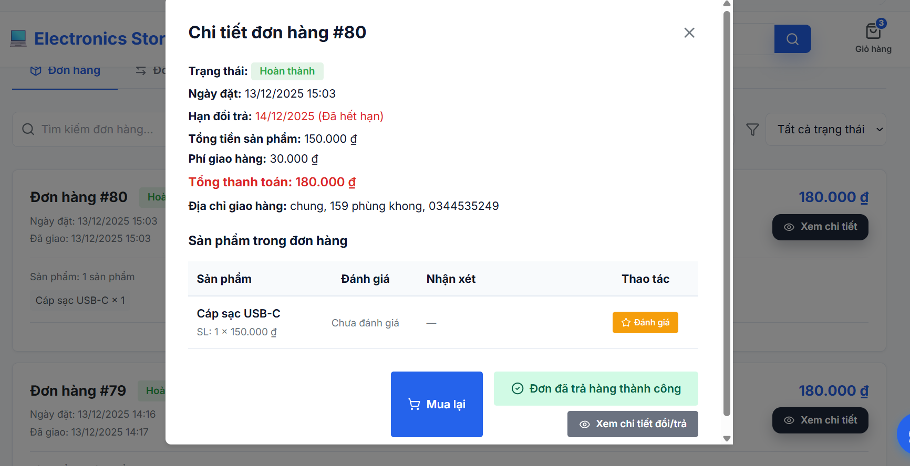
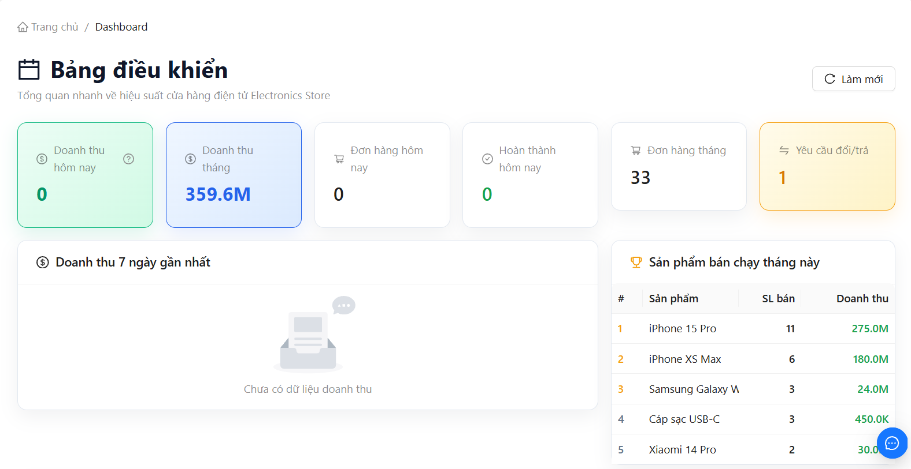
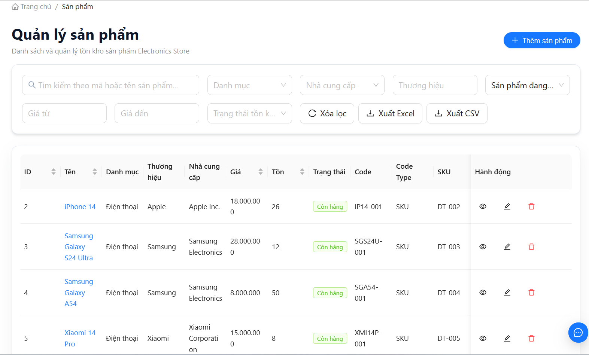
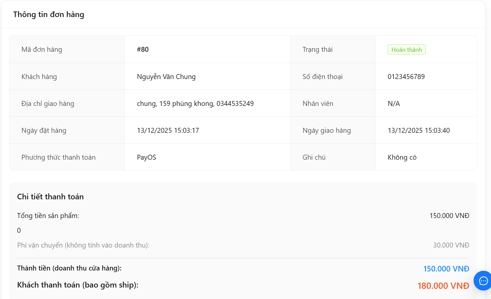
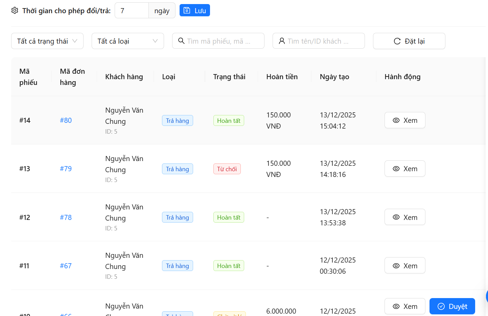

# E-commerce Store Management System

> A full-featured **e-commerce management platform** designed for **customers, store staff, and administrators**.  
>  
> The system provides:
> - A **shopping experience for customers** with product browsing, ordering, payment, and return requests.
> - An **admin & employee dashboard** to manage products, inventory, orders, shipping, and customer support.
> - An integrated **product recommendation service** that suggests related products based on user behavior.
>  
> This project was built for **learning and internship applications**, aiming to simulate a **real-world e-commerce workflow** and demonstrate how frontend, backend, and integrations work together in practice.

---

## Demo

> Some images of the client shopping website:

  
  
  
  
  

> Some images of the admin / employee dashboard:

  
  
  
  
  

> System and integration overview:

  
  
  

---

## Main Features

- **User Roles & Access Control**  
  Supports CUSTOMER, EMPLOYEE, and ADMIN roles with different permissions for shopping, order handling, and system management.

- **Product Browsing & Ordering**  
  Customers can browse products, view details, place orders, and track order status through the client interface.

- **Order & Inventory Management**  
  Admin and employees manage orders, update statuses, and adjust inventory data through the dashboard.

- **Payment & Shipping Integration**  
  Online payment is handled via **PayOS**, while shipping fee calculation and shipment creation are integrated with **GHN**.

- **Return & Refund Handling**  
  Customers can submit return requests, which are reviewed and processed by admins, with inventory updates applied accordingly.

- **Real-time Customer Support**  
  A built-in chat feature allows customers to communicate directly with admin or staff using WebSocket-based real-time messaging.

- **Product Recommendation (Basic)**  
  The system suggests related products based on user viewing behavior and product similarity.

---

## Technology Used

| Client / UI | Backend | Other Services |
|-------------|--------|------------|
| React (Client & Admin) | Spring Boot | MySQL |
| Ant Design / Tailwind CSS | Spring Data JPA | PayOS (Payment) |
| Axios | Spring Security (JWT) | GHN (Shipping) |
| WebSocket | FastAPI | Flyway |
|  |  | Swagger / Postman |

---

## Installation

### Required:
- JDK version ≥ 17  
- MySQL version ≥ 8.0  
- Maven version ≥ 3.8  
- Node.js ≥ 18 
- Python ≥ 3.10
